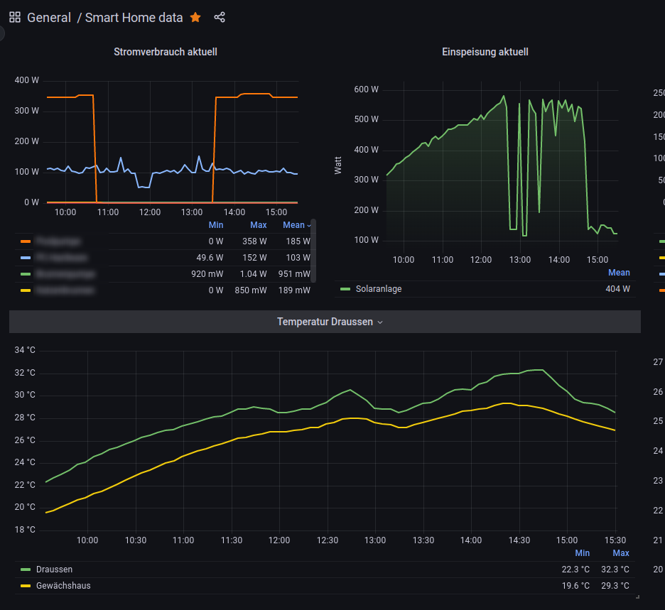

# homematic-metric-sync

This golang code integrates with the Homematic IP Cloud endpoint and polls for sensor data in regular intervals.
The aim of this repository is to collect current and data and persist them in a time series database (InfluxDB), which allows
to create a historic view on my smart home data.
It's not intended to provide a full integration with the API but just to collect metrics that might be releavant on a long-term scope.



## Build and Deployment

Due to the reason that requests towards Homematic tend to blocked from Cloud source ips, I'm running the code on my home network.
Any device with Container support should be fine.

The attached `Dockerfile` builds the app and bakes it into an image.

A configuration file is required for the app to get its endpoints:

```yaml
influx:
  url:          "http://<your-influx-instance>:8086"
  token:        "<app-token->" # APP token with write access to the target bucket
  organization: "my_org" # Organization name configured in influx
  bucket:       "hmip_sync" # an existing bucket

hmip:
  authToken: "" # An auth token to access Homematic Cloud. <https://github.com/hahn-th/homematicip-rest-api/blob/master/hmip_generate_auth_token.py>
  accessPoint: "<unique-access-point-id>" # The id of your Homematic IP access point
  userAgent: "golang 1.18" # Configurable user Agent used for User-Agent request header on http requests
  pollInterval: 300 # It is recommended not to poll data to frequently, otherwise request rate limit will hit you
  clientTokenSalt: "<client token>" # A static string used to create a hash. You can get it from: https://github.com/hahn-th/homematicip-rest-api/blob/master/homematicip/base/base_connection.py#L86
```

Run the app:

```sh
docker run -e "CONFIG_FILE=/hmip_sync.yaml" -d -v "$(pwd)/hmip_sync.yaml:/hmip_sync.yaml" -v "$(pwd)/data:/data" homeatic-metric-sync:latest
```

## Disclaimer

Homematic IP Cloud does not officially support access to their REST API, use this repo on your own risk.

## Thanks

This implementation was inspired by the work of <https://github.com/hahn-th/homematicip-rest-api>, which provides a full integration of the API.
